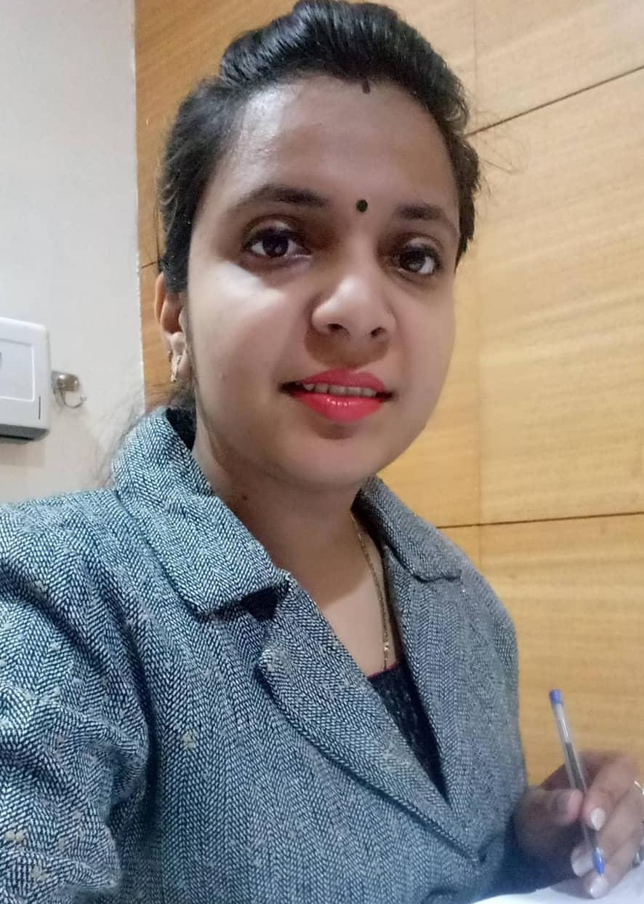
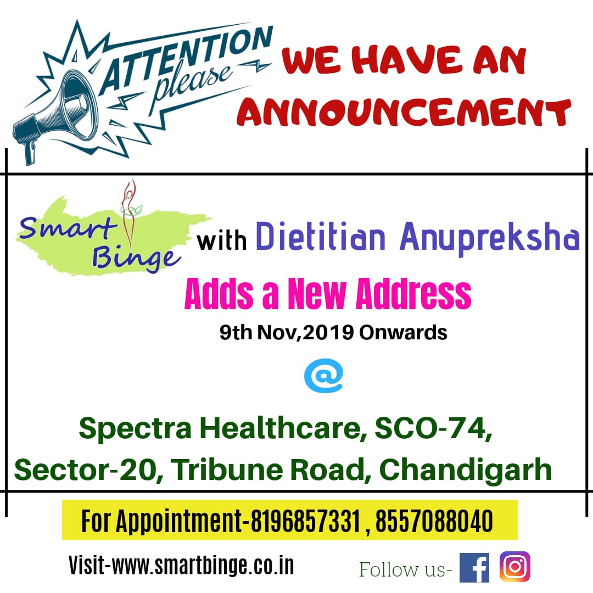

| 
Need dummy content here to make the image appear bigger
 | Experience                                                                                                                                                                                  |
| --------------------------------------------------------------------------------------------- | ------------------------------------------------------------------------------------------------------------------------------------------------------------------------------------------- |
|                                                   | 
My name is **_Dt. Anupreksha Rastogi_**. I am professionally a dietician with over 7 years of experience in Therapeutic Diets and weight management.
 |

Due to my regular interest in food, I prefered to pursue my studies in the subject. So, I did my Masters in Food Science from Banaras Hindu University in 2012. From there my journey began by working with the organizations like Fortis Healthcare, VLCC, Corporate offices, many chains and in the Trinity Hospital, Zirakpur Mohali previously.

She now works out of a clinic mentioned below.

Being a qualified dietician and a life member of Indian Dietetics Association, I believe in implementing safe, healthy eating habits not just thr numbers in weighing scale.
All this is taught throughout the journey of our programs.

### Expertise in:

- Therapeutics Diets
- Weight Management
- Diabetes Care
- Sports Nutrition for athletes
- Corporate Food Service Management.

#### Qualifications:

M.Sc. (Food & Nutrition)
CFN, DNHE
UGC-NET-June2012
Diabetes Educator

### Contact:

Reach out to Dt. Anupreksha on her email and/or her mobile number for a consultation.

**Email**: <mailto:smartbinge@gmail.com>

**Mobile**: <a href="tel:+91-8196857331">+91-8196857331</a>
**Mobile**: <a href="tel:+91-8557088040">+91-8557088040</a>

**Smart Binge Clinic Address**: Spectra Healthcare, SCO-74, Sector-20c, Tribune Road, Chandigarh
