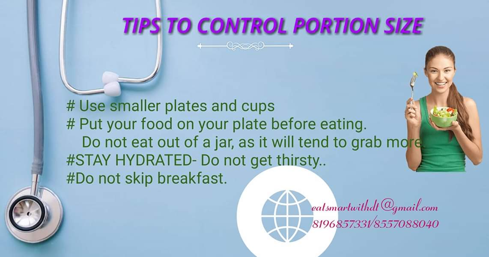

###Dietary Tips

- Cut down your salt intake
- Avoid processed/packed/ready to eat foods
- Avoid saturated & trans fats- Ghee/coconut oil/refined oil
- Avoid refined cereals

### Then what to eat?????

MODIFY your dietary pattern

