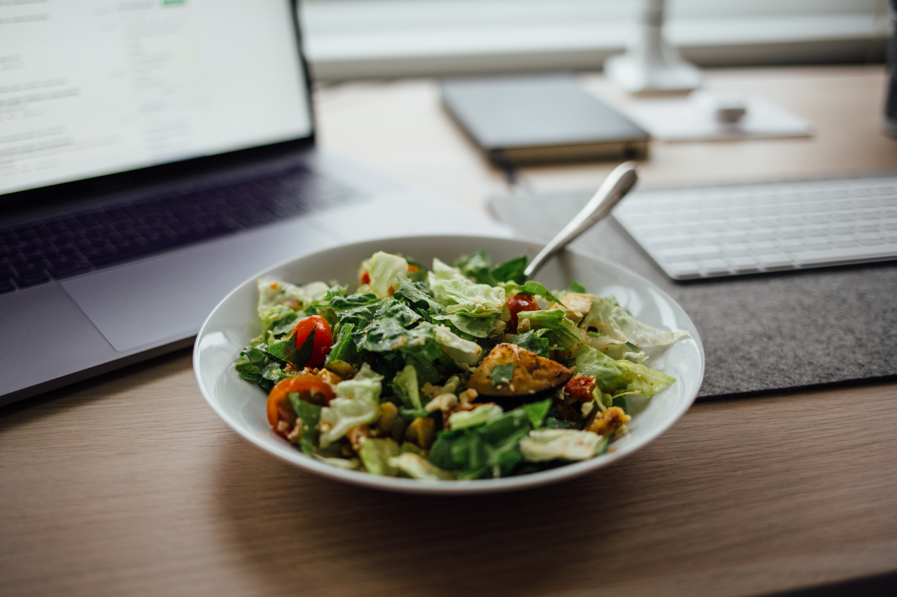

### Busting Food Myths

"SOUPS AND #SALADS ARE ALWAYS HEALTHY"

Soups and salads are not always low in calories.

**Soups with a lot of cream, starch, noodles, coconut etc are rich in calories.**
**Packaged soups also have higher sodium & thus are not healthy**
