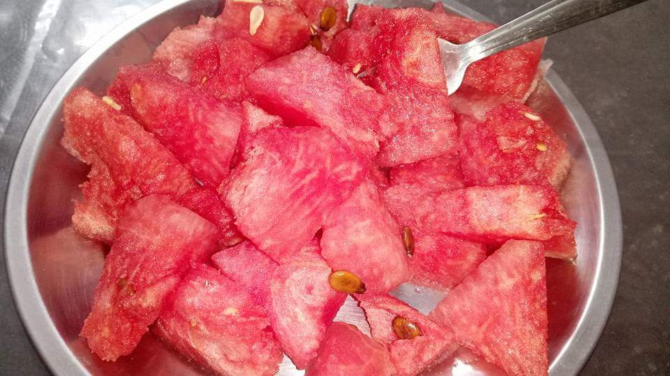

## Watermelon - Super Food

### Benefits

- Extremely high water content that helps us to hydrate.
- Helps to relieve muscle soreness
- Good for weight management as it gives prolong fullness.
- Good amount of carotene, good for skin and eyes.

### Can go bad

ShelfLife - Once it is cut, it can last for a day outside.
3-5 days inside Refrigerator.
