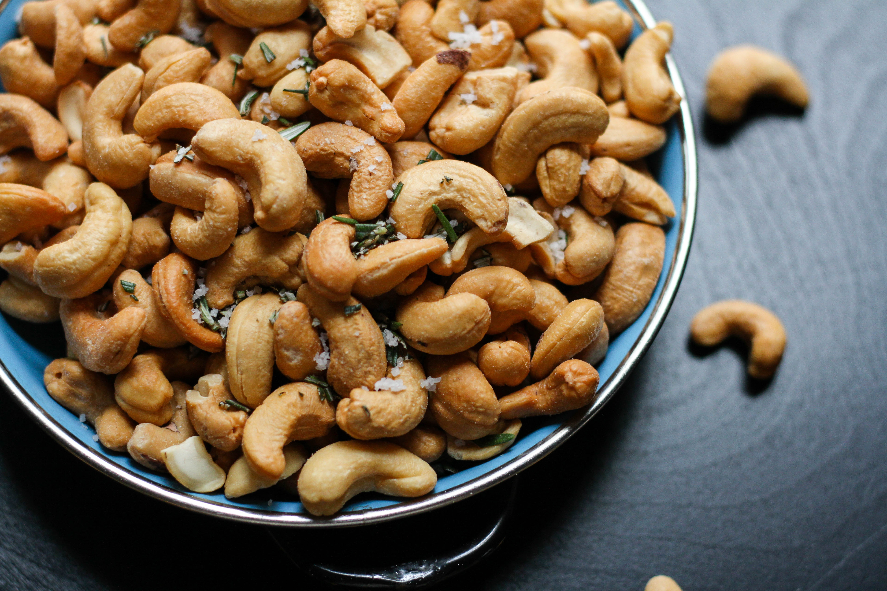

## Are cashews good for you?

Since our childhood, we have been fond of this Cashew Nut. While it leaves us with a sweet taste, there are many Myths around Kaju or Cashew being bad for your health.

LETS BREAK THEM TODAY....

Cashew Nuts are full of antioxidants, vitamins and minerals which are required for proper functioning of the body, these kidney shaped nuts are extremely beneficial.
Consumption of cashews has been linked to cancer prevention, heart health, and weight maintenance.

### Health benefits of CASHEWS

- strong bones
- heart healthy
- glowing skin
- prevent from cancer
- sharp mind
- hair growth
- strong gums
- reduce choleterol
- boosts immune system
- helps to lower the risk of formation of gallstones
- promotes formation of RBC's

Cashews make a great replacement for animal fats and proteins, and their delicious flavor makes them a satisfying snack.

Hence, they need to be taken in moderation.
