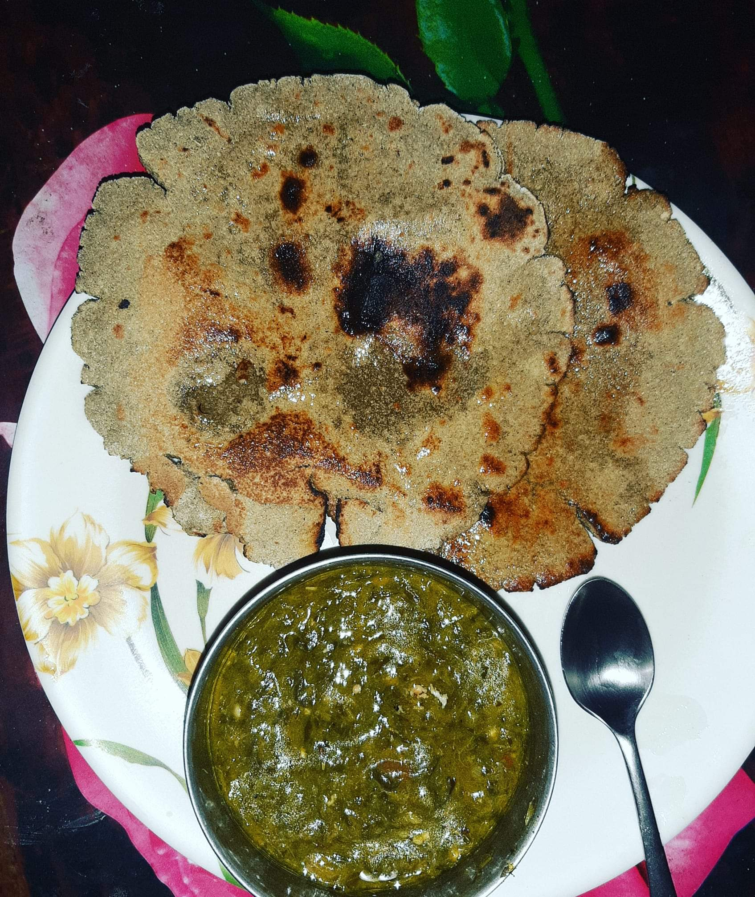

### Bajra

India is the largest producer of Bajra (Pearl Millet) and one of the oldest millets used by our ancestors. Being an Indian why not to consume with Sarson ka saag.
Bajra is rich in essential amino acids, phosphorus, calcium ,magnesium, iron and fibre.

- Provides good satiety.
- Powerfull to control diabetes.
- Reduces the effects of metabolic syndrome.
- Aids good digestion.
- Great in detoxifying.
- Prevents cancer.

### Sarson ka saag (mustard leaves)

Mustard leaves with spinach is a great combination to cherish with. It is also and Indian delicacy.
The dark green leaves carries ample amount of vitamins and minerals into it.
It is rich in fibre, vitamin K, many antioxidants like flavonoids, insoles, sulforaphanes, carotene etc.

### BENEFITS

- Aids in weight loss.
- Rich in many phytonutrients.
- Regular consumption of it helps to prevent arthritis, osteoporosis, anemia , CVD , Piles and many types of cancers .

###Saftey
Mustard leaves also contains goitrogens which interferes thyroid hormone production. Hence, patients with thyroid dysfunction nèed to avoid them.
