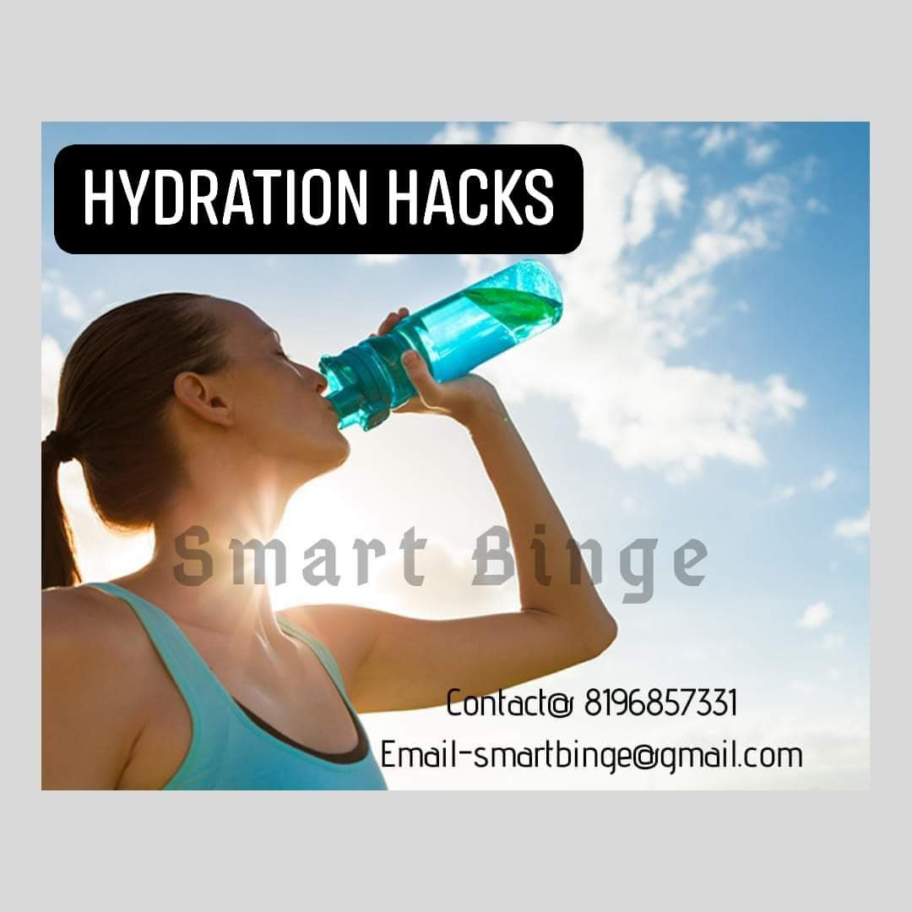

Did you know? Many of us do not consume enough of the required fluids.

When the temperatures are rising to 45 degrees Celsius, there are chances of sunburn and dehydration! It is the necessity to stay well hydrated. In this scorching heat, how to quench our thirst pangs interestingly is a task. So, let us check out some quick hydrating tips.

- Drink sufficient water.
- Drink better with some taste by adding a dash of lemon, slices or crushed cucumber, mint.
- Track your water consumption.
- If your a desk jockey, remember to keep a water bottle with you or wherever you are going
- Through foods- Watermelon, muskmelon, cucumber, coconut water, cherries are good sources to maintain the hydration levels in the body.
- Strictly avoid diuretics. Tea, coffee, alcohol are the NO-NOs in the heat.

### Benefits of Proper Hydration

- Weight management
- Strengthens immune system
- Prevents cramps
- Removes toxins
- Aids better digestion
- Makes skin look fresh

### 5 Rules of Water intake

1.  Always be seated first and then drink your water. Whether its 2 sips or 2 glasses. While sitting our nervous system is relaxed. Also, our digestive system and kidneys function better.
2.  Always drink water in the form of sips as we drink tea or coffee. Do not swallow directly from the container.
3.  Always consume water at room temperature. Too cold water adversely affects the digestive system and hampers the absorption of the nutrients. Also, consumption of lukewarm water helps to increase metabolism. Using mud pots are the best for scorching summer time.
4.  Avoid drinking water with meals or just after the meals for better functioning of digestive enzymes. Maintain the gap of 30minutes.
5.  Always drink water in small quantity and frequently. Avoid drinking too much at a time.
