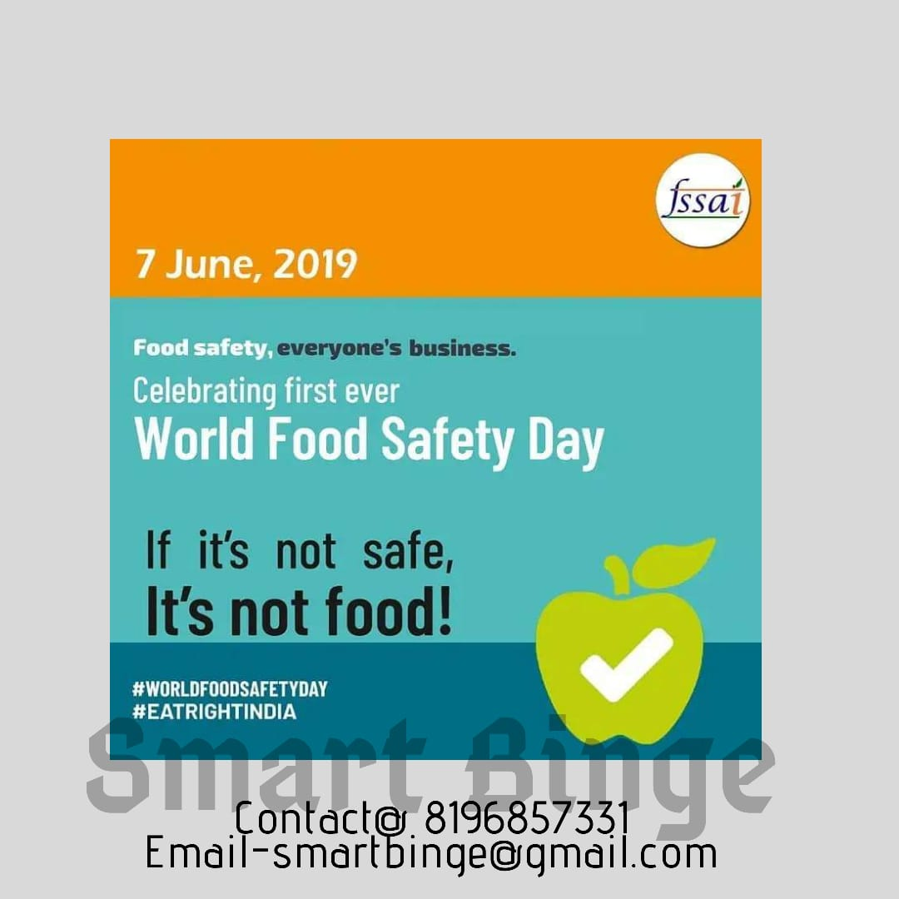

7th June 2019 is the first World Food Safety day which brings us to the question - Is the food we are eating safe enough to eat, whether it is from online booking or home cooking or anywhere?

    If it's not safe, it is not food.

Food is the most critical yet underrated aspect when we talk about health.
Eating out is not a crime, but eating unhygienic food leads to many health hazards. With the advent of so many food delivery services, many businesses have been selling unsafe and unsanitary food in the name of restaurants.

### 5 Pillars of Food Safety

1.  Maintain personal hygiene while handling the food

    - Wash hands with clean soap and water.
    - Keep your hair tied while cooking.
    - Keep nails short and clean.

**Reason**: Personal hygiene is essential to prevent contamination in food with germs from yourself, which can lead to food poisoning.

---

2.  Keep cooking and surrounding area clean.

    - Clean the kitchen area, counters, and sink regularly.
    - Keep dustbin covered and clean.
    - Do not throw food in kitchen sinks and drainage.

**Reason**: Unsanitary areas breed germs. Keeping these areas clean prevents contamination of food and thus, prevents food poisoning.

---

3.  Follow keys to safer food

    - Wash fruits and vegetables with clean water.
    - Separate raw and cooked food.
    - Refrigerate food within 2 hours of preparation.

### Reason:

Cleaning raw food before consuming, separating from cooked food, before consuming and refrigerating cooked food helps prevent food contamination from germs.

---

4.  Check food for adulteration and spoilage before consuming

    - Do not eat food that appears spoiled or has damaged packaging - in case of packed foods.
    - Test typical food adulteration using DART BOOK at www.fssai.gov.in
    - Report adulteration at www.fssai.gov.in

**Reason**: Adulterated and spoiled food and can cause a range of health hazards.
Checking food adulteration and spoilage before consuming helps to guard health.

---

5.  Read food labels to know what you are eating.

    - Look for FSSAI logo
    - Check the best before date
    - Check for food allergens
    - Check for the food ingredients.

**Reason**: Look for safety marks, logos, the best before the date to identify if the food has been deemed safe enough to consume by a trustworthy organization and that the manufacturers have taken proper care and followed due process while preparing the edible.
