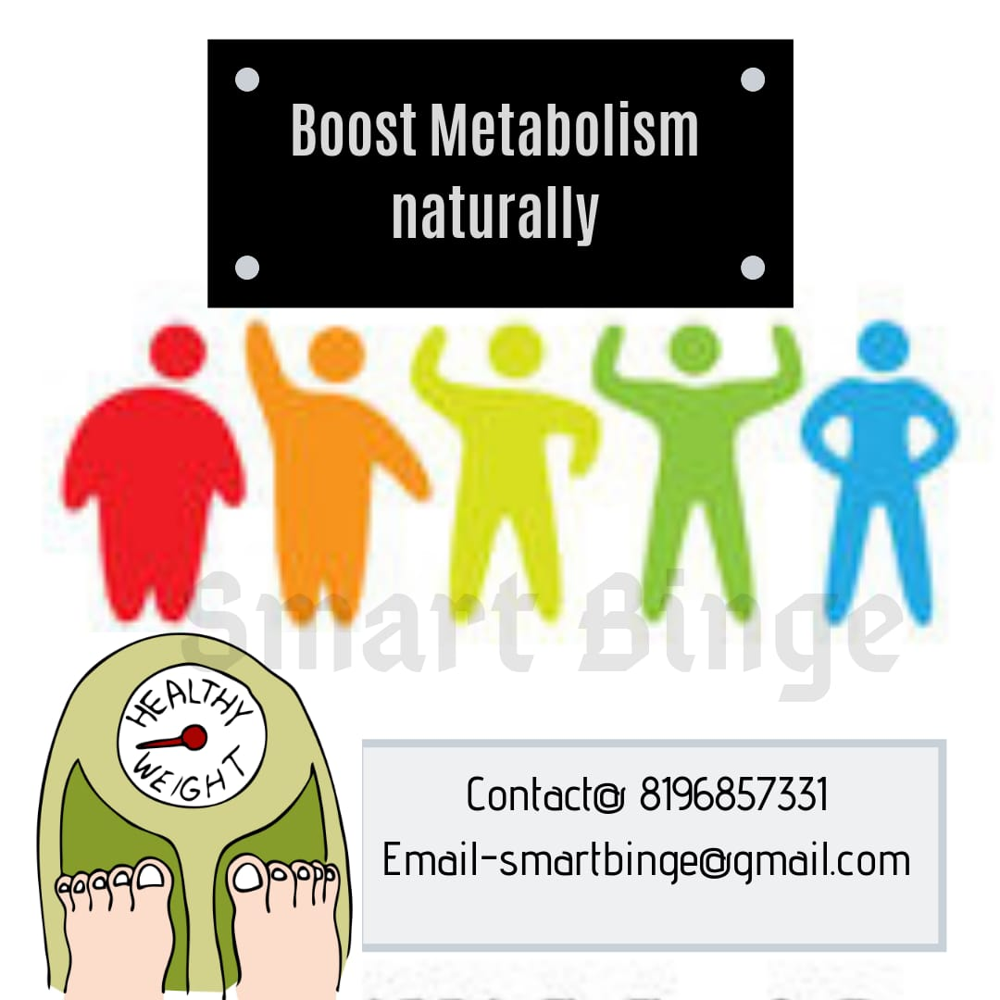

### How to boost metabolism naturally - 10 ways

In today's era of a sedentary lifestyle, weight loss has become a significant challenge. For many of us, it is always a nightmare, why we are not reducing our weight.
Some people have very high metabolism while some have very low. For those who have deficient metabolism, it is difficult to stop that stubborn increasing weight and visceral fat too.
There is no short cut for Losing a weight. Quacks like 'no diet or no exercise' are just money making machines, which create a lack of proper nutrition in us.
However, the fact is that **GOOD-BALANCED NUTRITION** and **REQUIRED EXERCISES** are the only things that can help us maintain our body.
So, here are some catchy scientific quick tips for you all that will help you.

1.  Eat small and frequent meals.
2.  Do not skip any meal.
3.  Plenty of required protein in every meal.
4.  Complex carbs intake daily
5.  High intensity workout/Weight training/ Resistance training.
6.  Good sound sleep
7.  Track your water intake
8.  Reduced stress
9.  Reduce fried foods and eat only healthy fats.
10. Use moderate spices.
