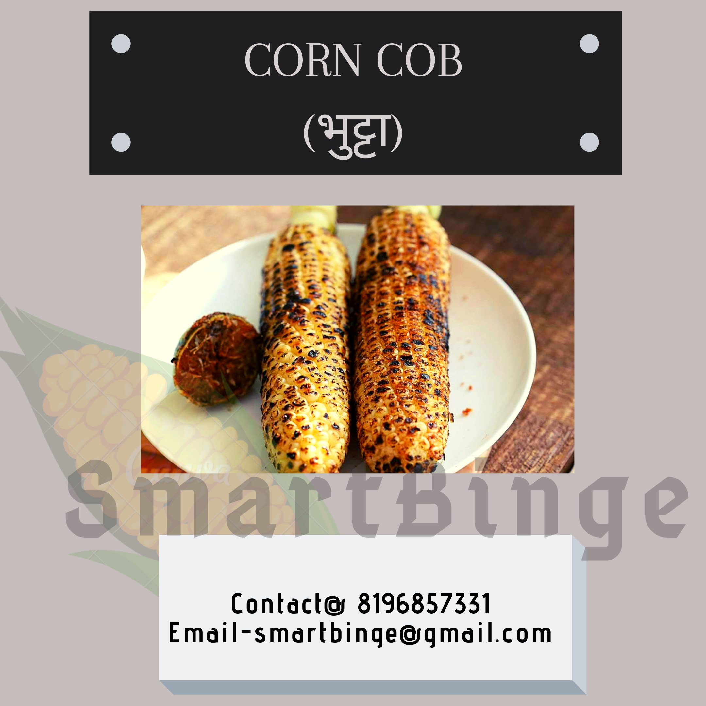

When it comes to the monsoon season, the cool breeze with drizzling makes us crave for those warm, grilled Corn cob - 🌽🌽. Some call it भुट्टा, some call it छल्ली and many more.
So all of you guys write to us what do you call it in your region.
A dash of lemon with a pinch of black salt is always lip-smacking and irresistible for all of us.
I still remember our childhood memories attached to it. In fact, every one of us does have such monsoon season memories with us. Every street, every town, every city, every state have it's own unique story.
This maize crop is cultivated mainly in North India. But Karnataka is the largest state for maize.
Here, we have some quick, exciting facts about our all-time favorite Corn.

### Nutritional Facts with Health Benefits 🤔

- It is the only amongst the cereal millet group, which is rich in Vitamin A (Carotenoid). Hence it promotes healthy vision and skincare.
- Being a good source of insoluble fiber, it is quite beneficial for gut health, prevents hemorrhoids, aids weight loss too.
- Vitamin B, Specifically Niacin and Thiamine rich: It helps in growth and development.
- Corn oil has an anti-atherogenic impact. It reduces bad cholesterol.
- Rich in essential minerals like phosphorus, magnesium, zinc, which aids in the proper functioning of bones, heart, and kidneys. It has more if phosphorus comparative to white rice.

### HEALTHY VERSIONS 😊

☆ Grilled corn cob.  
☆ Boiled corn cob.  
☆ Dishes like masala corn, spinach corn sandwich, corn capsicum sandwich, makai poha, corn capsicum masala veg, palak corn curry, and many more to go.  

### UNWANTED UNHEALTHY VERSIONS 😔

- People with toothache need to avoid consuming corn cob as such.

- Diabetic patients are also suggested to include sweetcorn, cornflakes in limitation due to high glycaemic index.

- We all go to supermarkets and buy processed stuff. **High fructose corn syrup** or **HFCS** in short, is a sweetener made of corn starch. It contributes **unwanted calories** that are linked with _significant health problems_ leading to **weight gain**, **diabetes mellitus**, and **metabolic syndrome**. It has a cheap market price, and is therefore affordable by food companies. HFCS is commonly found in the following items:

  - Soda
  - Sweetened Yoghurt
  - Candy
  - Frozen Junk food
  - Granola /Nutrition/Energy Bars
  - Sauces(Chocolate Sauces and syrups)
  - Coffee creamer
  - Energy drinks
  - Jams and Jellies
  - Ice-Cream
  - Processed desserts
  - Nut butter (Peanut butter/Hazelnut butter etc.)

### TAKE HOME MESSAGE

HFCS is an unhealthy ingredient. Unfortunately and unknowingly, we all assume them to be healthy. Hence, always double-check the ingredients.
