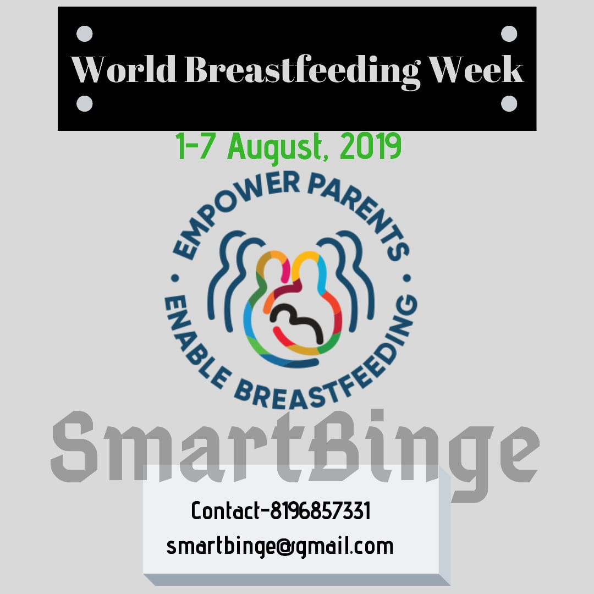

**World Breastfeeding Week** is celebrated from the **1st to 7th August**, all around the world. Its main aim is to encourage and spread awareness about the health benefits for the mother and the infant. The
The slogan for this year is

```markdown
Empower Parents, Enable Breastfeeding.
```

### The following are some important points:

- Feed the **colostrum (thick yellow milk)** to the infant within an hour of birth.
- The first thick milk of the mother is full of nutrients, which helps the infant to fight different diseases and protects from infections
- Mothers should feed their infants with their milk during its first six months. Don't give anything eatable, not even water.
- Start **weaning (Food Supplementing)** with cow's milk right after six months. **(Consult a Dietician)**

- **Take special care for the lactating mother's diet**, so that she can feed better to the newborn.
- **Immunize** the infant and mother to protect from diseases - I cannot stress this enough.
