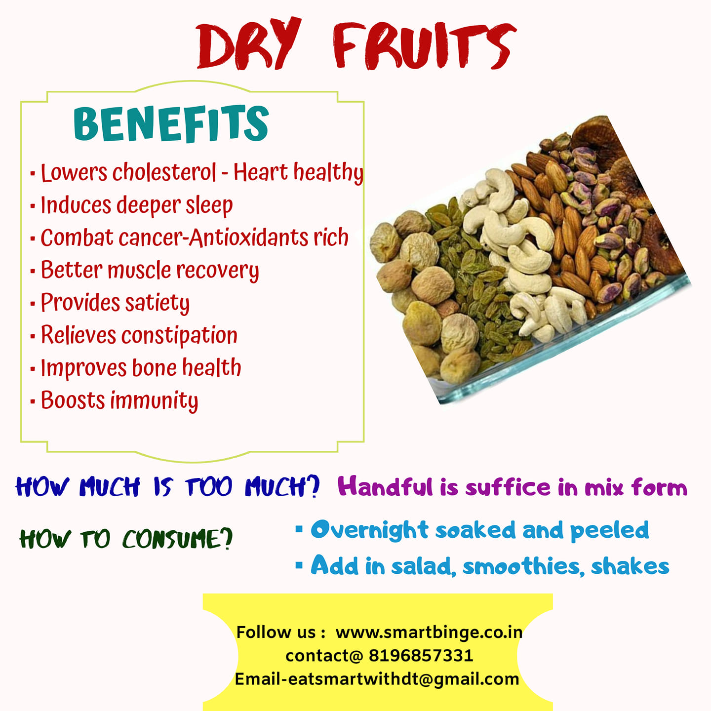

### Benefits

- Lowers cholesterol - Heart healthy
- Induces deeper sleep
- Combat cancer-Antioxidants rich
- Better muscle recovery
- Provides satiety
- Relieves constipation
- Improves bone health
- Boosts immunity

### Frequently asked Questions - FAQs

#### HOW MUCH IS TOO MUCH?

A handful is sufficing in mix form

#### HOW SHOULD IT BE CONSUMED?

Overnight soaked and peeled. Add in salads, smoothies or shakes
